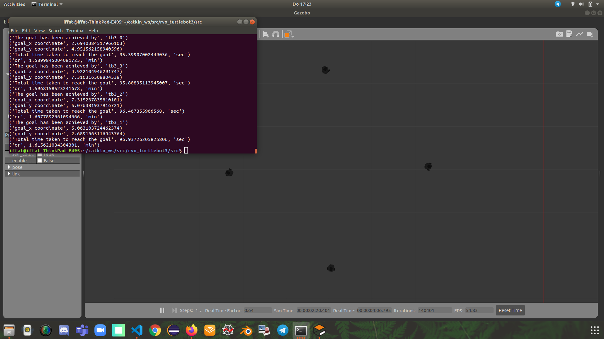

# A Multi-Agent Path Planning Algorithm Based on Velocity Obstacles
Welcome!
This multi-agent path planning algorithm is based on a reactive approach to avoid collisions with other robots in the run time. This algorithm is an attempt to implement 'Velocity Obstacles' or 'VO' without the information of other agents' velocity or position.
For details please click [here](#https://github.com/ovgu-FINken/multi_robot_path_planning/wiki/Implemented-Algorithm:-Based_on_VO). 

<!-- TOC START min:1 max:5 link:true asterisk:false update:true -->
- [Multi-Agent Algorithm Based on VO](#A-Multi-Agent-Path-Planing-Algorithm-Based-on-Velocity-Obstacles)
  - [System](#system)
  - [Implementation](#implementation)
    - [Python Scripts Nodes and Topics](#python-scripts-nodes-and-topics)
      - [PlainGround_Formation](#PlainGround_Formation)
      - [Run_Algo_Multiprocessing](#Run_Algo_Multiprocessing)
      - [VO_Based_Algo_Version2](#VO_Based_Algo_Version2)
  - [Execution](#execution)
  - [Results](#results)
  - [Remarks](#remarks)
  - [Benchmark Implementation](#benchmark-implementation)
      
<!-- TOC END -->

## System
This framework was tested under:
- Ubuntu 18.04
- ROS Melodic
- Gazebo
- Python 2.7

## Implementation
The Algorithm is being tested on turtlebot3(BURGER) in Gazebo simulation. 
The following Figure illustrates the node graph for one robot
(captured in RQT). 


### Python Scripts, Nodes and Topics

#### PlainGround_Formation
This python program will be responsible to run 'CircleFormationGoals' node and will publish this information using the topic(/goal), through a custom msg(Information).
(The Purpose of aligning robots in a circle formation and to make them swap positions with the robots on the opposite side, is to make sure maximum interaction among the moving robots and hence to see the efficiency of the algorithm )

#### Run_Algo_Multiprocessing
The **/run_algo_multiprocessing** is responsible for running the main algorithm as many times as the number of robots given by the user, using **/Python_Multiprocessing** feature. Moreover, this program will subscribe to the topic(/goal) and distribute it among the robots.

#### VO_Based_Algo_Version2
This is the main program with the algorithm. This will initiate the node with the name of the agent and subscribes to the topics **/tb3_x/odom** and **/tb3_x/scan**. After the processing, the node is responsible for controlling the robots through publishing **/tb3_x/cmd_vel**.

## Execution
Below are the instructions in order to run the algorithm.

First, make sure you are in the **/Based_on_VO** branch and **/rvo_turtlebot3** package.
The following sequence is crucial and must be followed as given;

1. Before running the following command make sure that you have **/turtlebot3_gazebo** package installed in your PC, otherwise the simulation environment will not work. This command will run the simulation environment, spawn the robot models(4,8 or 16) and will start the static transform publisher (TF)

```
roslaunch rvo_turtlebot3 turtlebot3_empty_world_4agents.launch 
 or
roslaunch rvo_turtlebot3 turtlebot3_empty_world_8robots.launch 
 or
roslaunch rvo_turtlebot3 turtlebot3_empty_world_16robots.launch 
```
2. After the successful spawning of the robots, use the following command to create circle formation for testing;
   (The program will ask for the number of robots, depending on how many robots have been spawned in the simulation kindly choose from 4,8 or 16)
```
~/driving_swarm/DrivingSwarm/src/pathplanning/vo_based_algo_without_benchmark/src$ python plainGround_formation.py 
```
3. Once the robots are aligned, run the algorithm using the following command :
```
~/driving_swarm/DrivingSwarm/src/pathplanning/vo_based_algo_without_benchmark/src$ python run_algo_multiprocessing.py
```

### Results
-This algorithm has been tested on 4, 8 and 16 robots(turtlebot3, Burger) in an empty world(without any static obstacles).

-This algorithm works very well with up to 8 robots. with the increase in the number of robots, the number of collisions increases too (with 16 robots there were ~3 collisions)





### Remarks
### Benchmark Implementation 
THANK YOU!
