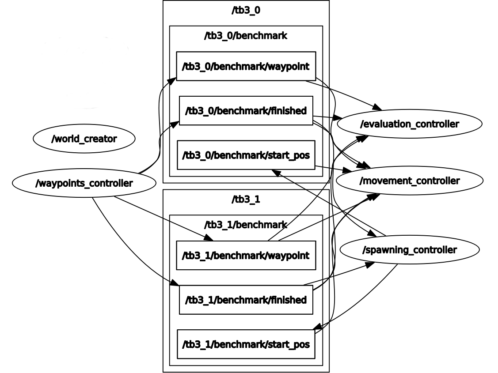

# Path Planning Benchmark
Welcome to the Path Planning Benchmark!
1. [System](#system)
2. [Implementation](#implementation)
3. [Settings](#settings)
4. [Worlds](#worlds)
5. [Execution](#execution)
6. [Evaluation](#evaluation)

## System
This framework was successfully tested under:
- Ubuntu 18.04
- ROS Melodic
- Python 2.7

## Implementation
The following Figure illustrates the node graph for two robots
(captured in RQT). Note that this graph was reduced to the benchmark
essential nodes and topics. (Here, the turtlebot model (tb3) is used.)



### Nodes and Topics

#### World Creator
The **/world_creator** is responsible for creating the gazebo world and is only 
essential in simulation-based benchmarks.

#### Spawning Controller
This also applies to the **/spawning_controller**,
which spawns the robot models, starts AMCL localization, the move base navigation, and
the static transform publisher (TF). The start positions of each robots are published under **/tb3_x/benchmark/start_pos**, which might be used
in the end procedure of the benchmark (see [settings](#settings)). This node is also capable of despawning a robot, therefore, the 
connection to the **/tb3_x/benchmark/finished** topic is required. This despawning, however, is only 
executed if (and only if) the despawn option is activated (see [settings](#settings)).

#### Waypoint Controller
After the robots are successfully spawned, the **/waypoint_controller** will load the waypoint map
and publishes the current target point (waypoint) for each robot, individually (**/tb3_x/benchmark/waypoint**).
Furthermore, this node publishes a boolean value to the **/tb3_x/benchmark/finished** topic, which 
indicates if a specific robot finished the benchmark.

#### Movement Controller
The **/movement_controller** is responsible for the movement of each robot. Here, a user defined 
path planner can be utilized. A subscription to the **/tb3_x/benchmark/waypoint** topic is used for 
the goal position, to which the robot should move. The value of the **/tb3_x/benchmark/finished** topic 
indicates if the robot has finished the benchmark and the end procedure (see [settings](#settings)) can be 
applied. Finally, the **/tb3_x/benchmark/start_pos** is used to move the back to the start position if the 
benchmark finished (Note, this option has to be activated, see [settings](#settings)).

#### Evaluation Controller
All evaluation related measurements are handled by the **/evaluation_controller**. 
Here, a timer is started and stopped, respectively, if a new waypoint is reached. This 
time is then used in a diversity of evaluation metrics. Therefore, a subscription to the 
current target position (**/tb3_x/benchmark/waypoint**) and the finished flag (**/tb3_x/benchmark/finished**)
is required.

## Settings

All adjustable parameter can be found in the settings file: `settings/settings.json`:
```
{
  "model_name": "turtlebot3",
  "model_type": "burger",
  "namespace": "tb3_",
  "number_of_robots": 4,
  "formation": "dense_block",
  "position": [1.5, 0.5, 0.5],
  "orientation": [0.0, 0.0, 0.0],
  "wp_map": "tb3_edge",
  "wp_threshold": 0.2,
  "world": "turtlebot3.world",
  "rounds": 1,
  "end_procedure": "despawn",
  "include_start_time": false
}
```

#### World Name
The **Model Name** defines the robot model to be used.
This can be set to: `turltebot3`.

#### Model Type
The **Model Type** defines the type of the robot model.
This can be set to: `burger`, `waffle`, or `waffle_pi`
for the `turtlebot3` model.

#### Namespace
The **Namespace** defines the String, which will be put in front
of the robot name for all topics and so on.
This can be set to every arbitrary String.

#### Number of Robots
The **Number of Robots** defines the number of robots, which should
be spawned and used in the benchmark.
This can be set to every Integer.

#### Formation
The **Formation** defines where the robots should be spawned.
This can be set to `dense_block` or `at_way_point`.

#### Position
The **Position** defines the position in the map for the spawning.
This is only be used, when the formation is set to `dense_block`, since
for other formations the positions are automatically computed.
This can be set to any valid position vector `[x, y, z]` in the map.

#### Orientation
The **Orientation** defines the orientation of the formation. This is 
similar to the position parameter and will only be used in the `dense_block`
formation. This can be set to any valid orientation euler vector.

#### Waypoint Map
The **Waypoint Map** defines the set of waypoints to be used.
This can be set to `maze` or `tb3_edge`. CAUTION: These waypoint maps are 
tailored to specific world files. Please, read the [world docs](doc).

#### Waypoint Threshold
The **Waypoint Threshold** defines the size of the waypoint.
More specifically, it defines the radius of the waypoint.
This can be set to any Float.

#### World Map
The **World** defines the gazebo world file, which will be loaded by 
gazebo after the execution of the benchmark.
This can be set to `maze.world`, `square.world`, `turtlebot3.world`, or
`tworooms.world` (All world files are located in the [world folder](worlds).).

#### Rounds
The **Rounds** variable defines the number the benchmark should run. 
Each waypoint map as a finite set of waypoints, once the initial waypoint 
is reached again one round is fulfilled. When all rounds are accomplished,
the benchmark finished.
This can be set to any Integer.

#### End Procedure
The **End Procedure** defines how the robots will behave after they 
successfully finished all rounds. Here, this can be set to `despawn`, which 
simply deletes the robot model. This, however, is only applicable in
simulation-based benchmarks. Alternatively, this variable can be set to 
`stay`, which will freeze the robot at the last waypoint, whereas the value 
`start` will send the start position as the next goal, such that 
the robot will move to the start position after the last waypoint is reached.
Ultimately, the `ìdle` state is a free state, where the robots might just move 
randomly, which is up to the user.

#### Include Start Time
The **Include Start Time** property is a boolean value, thus can be set to either
`true` or `false`. If enabled all [evaluation metrics](#evaluation) will include the 
time required to get from the initial start position (spawn point) to the first wayypoint.
Whereas, if disabled this time will not be included into the computation.

#### RQT & RVIZ
Furthermore, RQT and RVIZ can be started by enabling
the `ENABLE_RQT` and `ENABLE_RVIZ` flags, respectively.
These flags can be found in the `scripts/benchmark.sh` file.

## Worlds
The following world files are supported:
* [TB3 World](doc/TB3_WORLD.md)
* [Maze World](doc/MAZE_WORLD.md)
* [Warehouse 1 World](doc/WAREHOUSE_1_WORLD.md)
* [Warehouse 2 World](doc/WAREHOUSE_2_WORLD.md)

Please, refer to these document files for more information, like how to 
use these world maps and the corresponding waypoint maps.
Furthermore, note the `SLAM CONFORM` flag, which indicates SLAM conform asymmetric maps.

## Execution

First, make sure you are in the benchmark package.
The benchmark can be executed via:
```
bash ./scripts/benchmark.sh
```
The framework can be closed by typing:
```
bash ./scripts/kill.sh
```
This process can be highly accelerated by creating system keyboard shortcuts like:
```
gnome-terminal -- bash <FULL_PATH>/benchmark.sh
gnome-terminal -- bash <FULL_PATH>/kill.sh
```

## Evaluation

Whenever a robot is reaching a new waypoint the duration to reach this goal
is tracked and printed into the console, as well as stored in an [eval log](log/eval_log.txt).

Furthermore, for purely simulation-based benchmarks, the following benchmark scenario can be used 
to evaluate the performance for the path planner:
"Each benchmark file has a list of start/goal locations.
The intention is that one would add one agent at a time until
an algorithm cannot solve a problem in a given time/memory limit."
([Reference](https://movingai.com/benchmarks/mapf.html))

### General TXT log file
The general log file, can be found [here](log/log.txt).
This file provides the most comprehensive overview among all log files,
as such the other log files will refer to this file for more precise 
information. More specifically, this log file contains the entire parameter
list defined in the [settings](#settings). These parameters are shown in the 
header, which is created for each benchmark run. Afterwards all evaluation results
are stored in the body. For instance, a general log entry can look like this:
```
---------------------- BENCHMARK ----------------------
==> datetime: 2019-12-30 17:18:43.903142
==> Benchmark ID: 1577722723
==> model_name: turtlebot3
==> model_type: burger
==> namespace: tb3_
==> number_of_robots: 4
==> formation: dense_block
==> position: [1.5, 0.5, 0.5]
==> orientation: [0.0, 0.0, 0.0]
==> wp_map: tb3_edge
==> wp_threshold: 0.2
==> world: turtlebot3.world
==> rounds: 1
==> end_procedure: start
--------------------------------------------------------

[2019-12-30 17:20:41.077264] [WPTIME] tb3_3 from [1.8, 0.0, 0.0] to [-1.8, 0.0, 0.0] in 74.234s
[2019-12-30 17:20:47.376626] [WPTIME] tb3_1 from [1.8, 0.0, 0.0] to [-1.8, 0.0, 0.0] in 76.238s
[2019-12-30 17:21:36.520303] [WPTIME] tb3_0 from [1.8, 0.0, 0.0] to [-1.8, 0.0, 0.0] in 92.34s
[2019-12-30 17:21:49.072862] [WPTIME] tb3_2 from [1.8, 0.0, 0.0] to [-1.8, 0.0, 0.0] in 96.356s
[2019-12-30 17:21:49.108248] [WPTIME] tb3_3 from [-1.8, 0.0, 0.0] to [0.0, 1.8, 0.0] in 22.136s
[2019-12-30 17:22:39.036313] [WPTIME] tb3_0 from [-1.8, 0.0, 0.0] to [0.0, 1.8, 0.0] in 20.118s
[2019-12-30 17:22:39.066147] [WPTIME] tb3_1 from [-1.8, 0.0, 0.0] to [0.0, 1.8, 0.0] in 36.224s
[2019-12-30 17:22:51.752975] [WPTIME] tb3_3 from [0.0, 1.8, 0.0] to [0.0, -1.8, 0.0] in 20.11s
[2019-12-30 17:23:10.841155] [WPTIME] tb3_2 from [-1.8, 0.0, 0.0] to [0.0, 1.8, 0.0] in 26.162s
[2019-12-30 17:23:30.159001] [WPTIME] tb3_1 from [0.0, 1.8, 0.0] to [0.0, -1.8, 0.0] in 16.086s
[2019-12-30 17:23:42.918892] [WPTIME] tb3_0 from [0.0, 1.8, 0.0] to [0.0, -1.8, 0.0] in 20.112s
[2019-12-30 17:24:01.810786] [WPTIME] tb3_2 from [0.0, 1.8, 0.0] to [0.0, -1.8, 0.0] in 16.102s
[2019-12-30 17:24:01.850099] [WPTIME] tb3_3 from [0.0, -1.8, 0.0] to [1.8, 0.0, 0.0] in 22.146s
[2019-12-30 17:24:45.809623] [WPTIME] tb3_1 from [0.0, -1.8, 0.0] to [1.8, 0.0, 0.0] in 24.158s
[2019-12-30 17:24:45.841787] [WPTIME] tb3_3 from [1.8, 0.0, 0.0] to [-1.8, 0.0, 0.0] in 14.082s
[2019-12-30 17:24:45.842267] [MAKESPAN] 3 finished with makespan of 152.71s <<<
[2019-12-30 17:24:45.843561] [FLOWTIME] 3: 38.1775
[2019-12-30 17:24:58.359468] [WPTIME] tb3_0 from [0.0, -1.8, 0.0] to [1.8, 0.0, 0.0] in 24.156s
[2019-12-30 17:25:04.621223] [WPTIME] tb3_2 from [0.0, -1.8, 0.0] to [1.8, 0.0, 0.0] in 20.138s
[2019-12-30 17:25:29.290527] [WPTIME] tb3_1 from [1.8, 0.0, 0.0] to [-1.8, 0.0, 0.0] in 14.078s
[2019-12-30 17:25:29.291749] [MAKESPAN] 1 finished with makespan of 166.784s <<<
[2019-12-30 17:25:29.292400] [FLOWTIME] 1: 41.6965
[2019-12-30 17:25:47.299039] [WPTIME] tb3_2 from [1.8, 0.0, 0.0] to [-1.8, 0.0, 0.0] in 14.05s
[2019-12-30 17:25:47.300320] [MAKESPAN] 2 finished with makespan of 172.81s <<<
[2019-12-30 17:25:47.301209] [FLOWTIME] 2: 43.2025
[2019-12-30 17:26:28.273215] [WPTIME] tb3_0 from [1.8, 0.0, 0.0] to [-1.8, 0.0, 0.0] in 30.152s
[2019-12-30 17:26:28.275050] [MAKESPAN] 0 finished with makespan of 186.88s <<<
[2019-12-30 17:26:28.276239] [FLOWTIME] 0: 46.72
```

### WP-Time log file
The WP-Time log file, can be found [here](log/log_wptime.csv).
The WP-Time is the time needed for a robot to get from WP to WP.
Fundamentally, this CSV file can be further utilized for visualizations.
It contains the following information:

BENCHMARK ID | ROBOT | WP 1 | WP 2 | WPTIME
--- | --- | --- | --- | --- |

For the Benchmark ID please refer to the general log file.

### Flowtime log file
The flowtime log file, can be found [here](log/log_flowtime.csv).
The flowtime is the average time needed for a robot to get from WP to WP.
Fundamentally, this CSV file can be further utilized for visualizations.
It contains the following information:

BENCHMARK ID | ROBOT | FLOWTIME
--- | --- | --- |

For the Benchmark ID please refer to the general log file.

### Average Flowtime log file
The flowtime log file, can be found [here](log/log_flowtime_avg.csv).
The average flowtime is the average time for all robots to get from WP to WP.
Fundamentally, this CSV file can be further utilized for visualizations.
It contains the following information:

BENCHMARK ID | AVERAGE FLOWTIME
--- | --- |

For the Benchmark ID please refer to the general log file.

### Makespan log file
The makespan log file, can be found [here](log/log_makespan.csv).
The makespan is the time needed for a robot to finish the complete benchmark (all rounds).
Fundamentally, this CSV file can be further utilized for visualizations.
It contains the following information:

BENCHMARK ID | ROBOT | MAKESPAN
--- | --- | --- |

For the Benchmark ID please refer to the general log file.

### Average Makespan log file
The makespan log file, can be found [here](log/log_makespan_avg.csv).
The average makespan is the average time for all robots to to finish the complete benchmark (all rounds).
Fundamentally, this CSV file can be further utilized for visualizations.
It contains the following information:

BENCHMARK ID | AVERAGE MAKESPAN
--- | --- |

For the Benchmark ID please refer to the general log file.

### Clean log files
All log files can be cleaned (content deletion) via the following shell script:
```
bash scripts/clean_log.sh
```