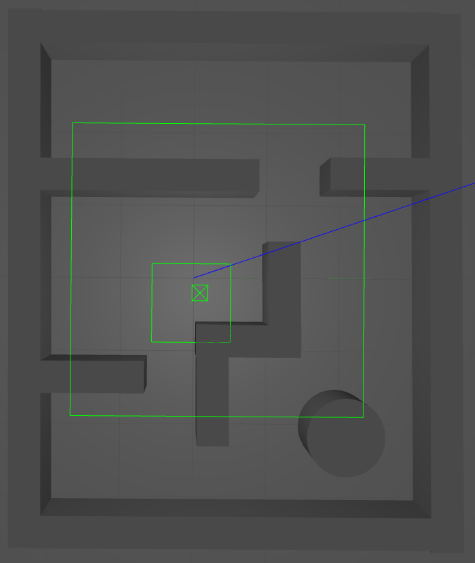
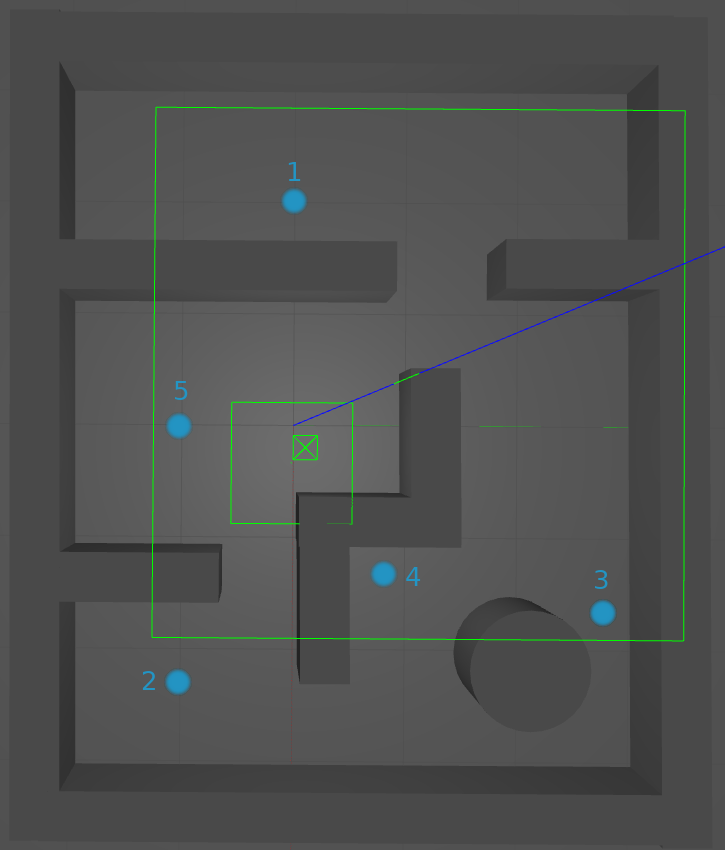

# Maze World
This file contains information about the Maze world.
1. [Usage](#usage)
2. [World](#world)
3. [Waypoints](#waypoints)

## Usage
For using this world file in the benchmark, please set the `world` option 
in the `settings/settings.json` file to `maze.world`. 

## World
The Maze worlds:

## Waypoints
This world is equipped with one waypoint map: `maze`.
The `maze` map contains five waypoints located across of the map:

