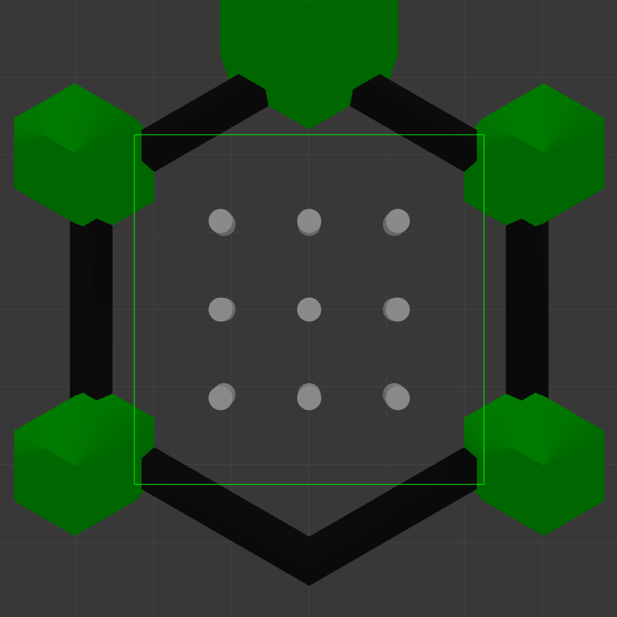
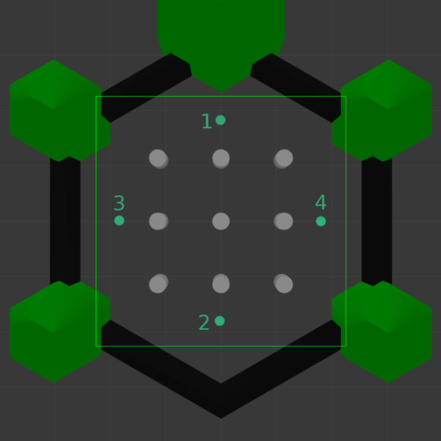

# TB3 World
:x: NOT SLAM CONFORM

This file contains information about the Turtlebot3 world.
1. [Usage](#usage)
2. [World](#world)
3. [Waypoints](#waypoints)

## Usage
For using this world file in the benchmark, please set the `world` option 
in the `settings/settings.json` file to `turtlebot3.world`. 

## World
The Turtlebot3 worlds:

## Waypoints
This world is equipped with one waypoint map: `tb3_edge`.
The `tb3_edge` map contains four waypoints located at the edges of the map:

All Waypoints (WP-IDs) and their corresponding positions
[x,y,z] in the map are summarized in this table: 

WP-ID | x | y | z
--- | --- | --- | ---
1 | 1.8 | 0.0 | 0.0
2 | -1.8 | 0.0 | 0.0
3 | 0.0 | 1.8 | 0.0
4 | 0.0 | -1.8 | 0.0

<< [Back to README](../README.md).
