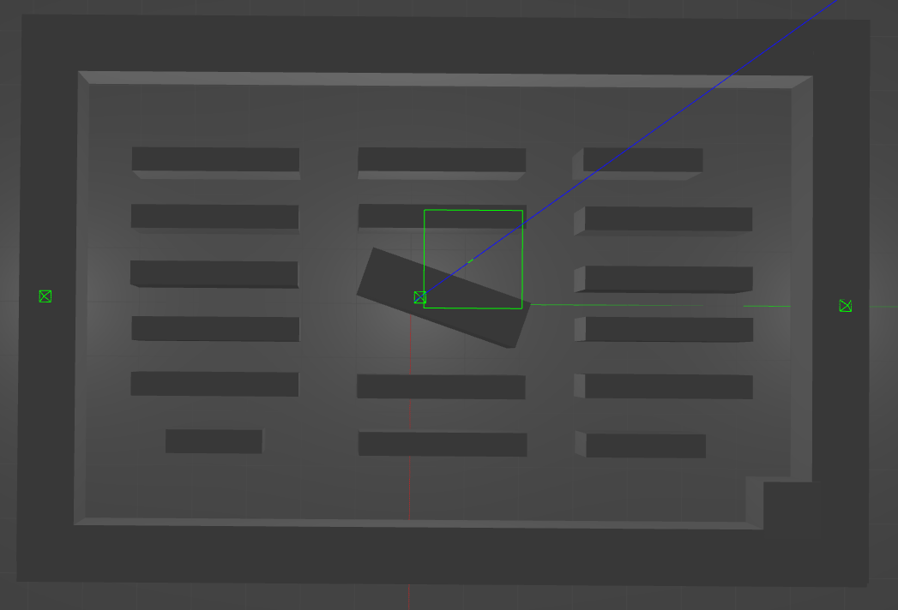
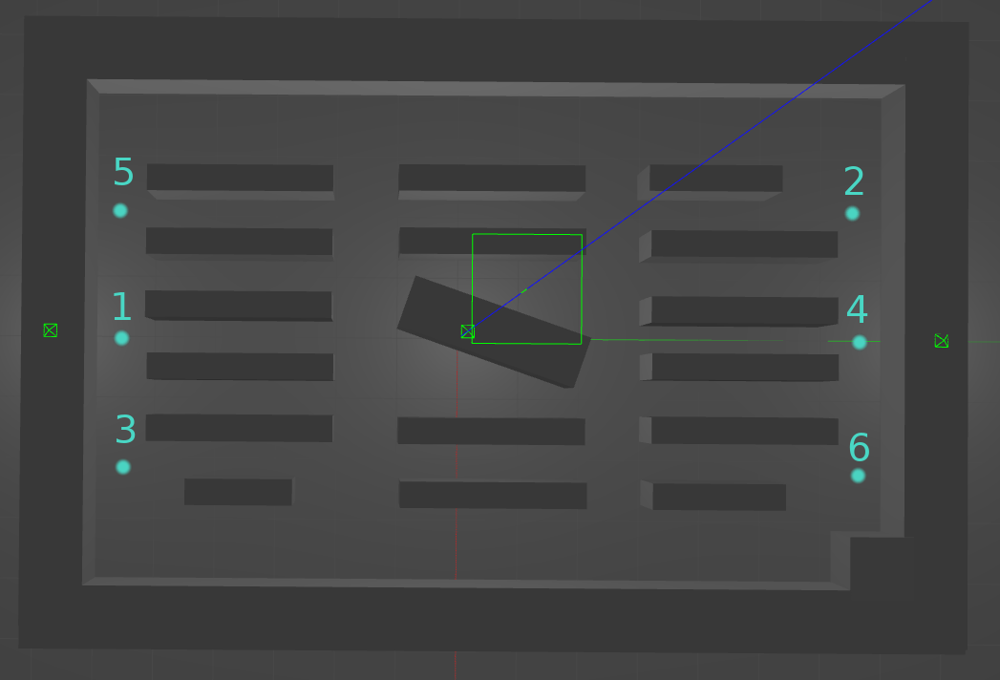

# Warehouse 2 World
:white_check_mark: SLAM CONFORM

This file contains information about the Warehouse world.
1. [Usage](#usage)
2. [World](#world)
3. [Waypoints](#waypoints)

## Usage
For using this world file in the benchmark, please set the `world` option 
in the `settings/settings.json` file to `warehouse_2.world`. 

## World
The warehouse world:

## Waypoints
This world is equipped with one waypoint map: `warehouse_2`.
The `warehouse_2` map contains six waypoints, such that the robots have to
move zagzag:

All Waypoints (WP-IDs) and their corresponding positions
[x,y,z] in the map are summarized in this table: 

WP-ID | x | y | z
--- | --- | --- | ---
1 | 0.0 | -5.5 | 0.0
2 | -2.0 | 6.5 | 0.0
3 | 2.0 | -5.5 | 0.0
4 | 0.0 | 6.5 | 0.0
5 | -2.0 | -5.5 | 0.0
6 | 2.0 | 6.5 | 0.0

<< [Back to README](../README.md).
